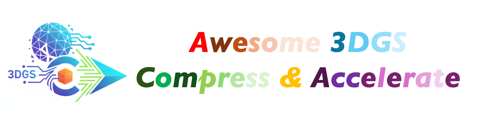

<h1 align="center">🎉 Awesome-3DGS-Compress-Accelerate 🔥</h1>

🦠Exploring the latest papers in 3DGS Compress & Accelerate. ğŸ¦

---

 

---

---

### ✨You are welcome to provide us your work with a topic related to 3DGS Compress & Accelerate.✨

If you discover any missing work or have any suggestions, please feel free to submit a pull request or contact us (  ). We will promptly add the missing papers to this repository.

---

## 🌑  2025

#### [CVPR 2025] Speedy-Splat: Fast 3D Gaussian Splatting with  Sparse Pixels and Sparse Primitives ( Compress & Accelerate )     

- **🏫 单位**：University of Maryland, College Park
- **✨ 说明**：⚡压缩：剪枝策略； 🚀 加速：精确gs、tile相交像素判断；

#### [CVPR 2025] PUP 3D-GS: Principled Uncertainty Pruning for 3D Gaussian Splatting( Compress )   

- **🏫 单位**：University of Maryland, College Park
- **✨ 说明**：⚡压缩：剪枝策略；

## Contributing

Contributions are welcome! Please feel free to create an issue or open a pull request with your contributions.

<table>
  <tbody>
    <tr>
      <td align="center" valign="top" width="14.28%"><a href="https://github.com/haozheguo"> <b>Haozhe Guo</b></a> <a href="https://github.com/haozheguo" title="Code">💻</a> <a href="https://github.com/haozheguo" title="Design">🎨</a> <a href="https://github.com/haozheguo" title="Ideas, Planning, & Feedback">🤔</a></td>
      </tr>
  </tbody>
</table>

